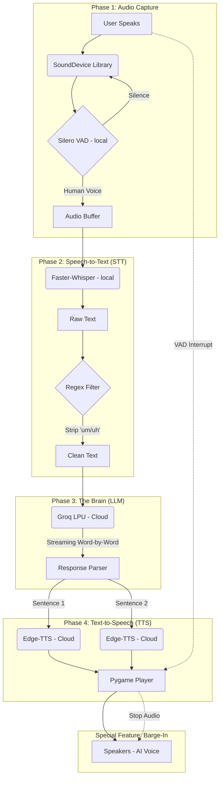

# 🎙️ SpeechAgent Workflow & Technologies

## 📐 System Architecture

---

## 🛠 Technology & Library Stack

| Component | Technology / Library | Description |
|---|---|---|
| **Audio Capture** | `sounddevice` | Handles real-time microphone streaming. |
| **VAD Filter** | `silero-vad` | Detects human speech patterns and ignores noise. |
| **STT Engine** | `faster-whisper` | Local neural engine for high-accuracy transcription. |
| **LLM Backend** | `groq` | Ultra-fast cloud inference (fallback to `ollama`). |
| **TTS Engine** | `edge-tts` | Cloud-based neural voice synthesis (Microsoft). |
| **Audio Output** | `pygame-ce` | Handles low-latency playback & interruptions. |
| **Data Handler** | `numpy` / `scipy` | Manages audio signal normalization and resampling. |
| **Environment** | `python-dotenv` | Securely manages API keys from a `.env` file. |
