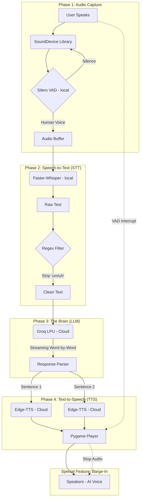

# 🎙️ SpeechAgent Workflow & Technologies

## 📐 System Architecture



---

## 🛠 Technology & Library Stack

| Component | Technology / Library | Description |
|---|---|---|
| **Audio Capture** | `sounddevice` | Handles real-time microphone streaming. |
| **VAD Filter** | `silero-vad` | Detects human speech patterns and ignores noise. |
| **STT Engine** | `faster-whisper` or **AssemblyAI** (`assemblyai` SDK) | Local Whisper, or cloud pre-recorded STT when `STT_PROVIDER=assemblyai` (see below). |
| **LLM Backend** | `groq` | Ultra-fast cloud inference (fallback to `ollama`). |
| **TTS Engine** | `edge-tts` | Cloud-based neural voice synthesis (Microsoft). |
| **Audio Output** | `pygame-ce` | Handles low-latency playback & interruptions. |
| **Data Handler** | `numpy` / `scipy` | Manages audio signal normalization and resampling. |
| **Environment** | `python-dotenv` | Securely manages API keys from a `.env` file. |

---

## Speech-to-text (STT) backend

`config.py` reads `.env`:

| Variable | Description |
|----------|-------------|
| `STT_PROVIDER` | `whisper` or `assemblyai`. If **unset** and `ASSEMBLYAI_API_KEY` or `AssemblyAI_API_KEY` is set, defaults to **`assemblyai`**. Otherwise **`whisper`**. |
| `ASSEMBLYAI_API_KEY` / `AssemblyAI_API_KEY` | AssemblyAI API key (either variable name works). |
| `ASSEMBLYAI_SPEECH_MODELS` | Comma-separated model ids (default `universal-2`). Example: `universal-3-pro`. |
| `ASSEMBLYAI_LANGUAGE_CODE` | Language for transcription (default `en`). |

- **`python main.py`** uses `stt_engine.py` (Silero VAD, then Whisper or AssemblyAI per utterance).
- **`python stt_server.py`** WebSocket `/stt` uses the same `STT_PROVIDER` (meeting-bot loopback STT).

Install AssemblyAI: `pip install assemblyai`.

---

## Structured JD interview (`llm_brain.py` + `interview_plan.py`)

When **`INTERVIEW_STRUCTURED=true`** (default) and **`document.jd`** is non-empty, the LLM prepares **15 spoken questions**: **5 JD themes × 3 questions**.

- Questions are derived from the JD via a single planning completion (Groq preferred, Ollama fallback).
- **Phase gate**: on answers to the **first N** scripted questions (`INTERVIEW_GATE_FIRST_N`, default `5`), repeated strike verdicts (`INTERVIEW_STRIKES_TO_END`, default **3**) end the interview; the **scorecard is printed in the terminal only** (not spoken) in `main.py`, then the process stops the mic loop.
- After the **15th** answer, the **closing scorecard** is also **terminal-only** in `main.py` (not TTS).
- Set **`INTERVIEW_STRUCTURED=false`** in `.env` to revert to purely free-form questioning (JD/resume grounding only).
- After a **phase-gate strike** with strikes still below the threshold, the **next** interviewer completion includes a **one-time system instruction**: brief calm redirect, then the **next** scripted question. Developer logs use a **ruled metrics panel** (see console output).

| Variable | Purpose |
|---------|---------|
| `INTERVIEW_STRUCTURED` | `true`/`false` — enable 15-Q plan + scorecard pipeline |
| `INTERVIEW_GATE_FIRST_N` | How many scripted answers are subject to the strict gate |
| `INTERVIEW_STRIKES_TO_END` | Strikes in that window before early finish (default **3**) |
| `INTERVIEW_TERMINAL_SCORES` | `true`/`false` — relevance line(s) inside the metrics panel (extra LLM call per answer) |

- **End of interview:** the spoken **scorecard is not sent to TTS** in standalone `main.py` — it is printed under **FINAL CANDIDATE REPORT** in the terminal, then `is_running` is set to **false** so the app exits the mic loop. Metrics blocks use **72-char ruled panels** (flushed) so lines do not interleave with `Listening...`.

---

## Runtime Modes

Use one of the two entry points depending on your goal.

### 1) Standalone Interactive Mode (auto-greet + local two-way)

Run:

```bash
python main.py
```

Behavior:
- AI speaks startup greeting automatically (`STARTUP_GREETING` in `config.py`)
- local microphone listens for your speech
- STT -> LLM (interviewer persona) -> TTS response loop

### 2) Meeting-Bot Bridge Mode (API server for .NET)

Run:

```bash
python ai_bridge_server.py
```

Behavior:
- starts FastAPI server only
- serves `/v1/interview/fixed-line` and `/v1/interview/respond`
- TTS uses **Edge-TTS** with `TTS_VOICE` / `TTS_RATE` from `.env` (same defaults as `main.py`, e.g. Prabhat). Put **ffmpeg** on `PATH` so audio is converted to **16 kHz mono WAV** for Teams `playPrompt`; without ffmpeg, MP3 URLs may be used instead.
- no autonomous local mic/speaker conversation loop

Use this mode when `backend/meeting-bot` is orchestrating Teams call flow.

For **Windows Step A** (local loopback → STT → auto reply in Teams), also run **`python stt_server.py`** on port **8020** and enable **`MeetingBot:EnableSttVoiceLoop`** (see `meeting-bot/README.md`).
