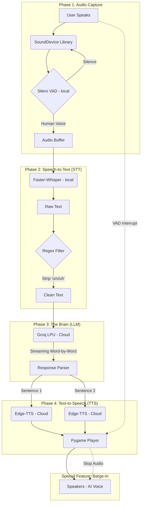

# 🎙️ SpeechAgent Workflow & Technologies

## 📐 System Architecture



---

## 🛠 Technology & Library Stack

| Component | Technology / Library | Description |
|---|---|---|
| **Audio Capture** | `sounddevice` | Handles real-time microphone streaming. |
| **VAD Filter** | `silero-vad` | Detects human speech patterns and ignores noise. |
| **STT Engine** | `faster-whisper` | Local neural engine for high-accuracy transcription. |
| **LLM Backend** | `groq` | Ultra-fast cloud inference (fallback to `ollama`). |
| **TTS Engine** | `edge-tts` | Cloud-based neural voice synthesis (Microsoft). |
| **Audio Output** | `pygame-ce` | Handles low-latency playback & interruptions. |
| **Data Handler** | `numpy` / `scipy` | Manages audio signal normalization and resampling. |
| **Environment** | `python-dotenv` | Securely manages API keys from a `.env` file. |

---

## Runtime Modes

Use one of the two entry points depending on your goal.

### 1) Standalone Interactive Mode (auto-greet + local two-way)

Run:

```bash
python main.py
```

Behavior:
- AI speaks startup greeting automatically (`STARTUP_GREETING` in `config.py`)
- local microphone listens for your speech
- STT -> LLM (interviewer persona) -> TTS response loop

### 2) Meeting-Bot Bridge Mode (API server for .NET)

Run:

```bash
python ai_bridge_server.py
```

Behavior:
- starts FastAPI server only
- serves `/v1/interview/fixed-line` and `/v1/interview/respond`
- TTS uses **Edge-TTS** with `TTS_VOICE` / `TTS_RATE` from `.env` (same defaults as `main.py`, e.g. Prabhat). Put **ffmpeg** on `PATH` so audio is converted to **16 kHz mono WAV** for Teams `playPrompt`; without ffmpeg, MP3 URLs may be used instead.
- no autonomous local mic/speaker conversation loop

Use this mode when `backend/meeting-bot` is orchestrating Teams call flow.

For **Windows Step A** (local loopback → STT → auto reply in Teams), also run **`python stt_server.py`** on port **8020** and enable **`MeetingBot:EnableSttVoiceLoop`** (see `meeting-bot/README.md`).
