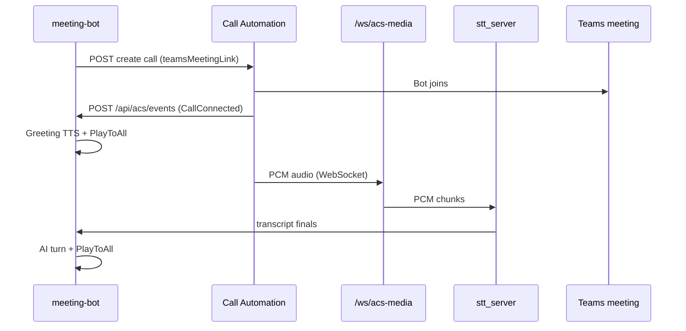

# ACS architecture (ACS_Dev)

**Teams meeting join:** use `MeetingBot__MeetingJoinBackend=Graph` (default). ACS Call Automation REST does not define `teamsMeetingLink` targets; requests with that shape return `400 payload is missing`. ACS media WebSocket + `PlayToAll` apply when `MeetingJoinBackend=Acs` on supported call types.

## Flow (ACS join path — not Teams meeting link today)

## Azure prerequisites

1. **ACS resource** with **Teams interoperability**
2. **Connection string** → `Acs__ConnectionString`
3. **Public HTTPS** → `MeetingBot__CallbackBaseUrl` (ngrok/dev tunnel)
4. ACS must reach:
   - `{CallbackBaseUrl}/api/acs/events`
   - `wss://{host}/ws/acs-media` (derived from same base URL)

## Graph (Teams join — default)

`POST /api/meetings/start` with `MeetingJoinBackend=Graph` uses `POST /communications/calls` and callbacks on `/api/calls/callback`. Requires Graph app permissions (`Calls.JoinGroupCall.All`, `Calls.AccessMedia.All`, etc.) and application access policy for the organizer. See `docs/teams-meeting-join-plan.md`.

Graph is also used for `POST /api/meetings/create` (`onlineMeetings`).

## References

- [Audio streaming quickstart](https://learn.microsoft.com/en-us/azure/communication-services/how-tos/call-automation/audio-streaming-quickstart)
- [Create Call REST](https://learn.microsoft.com/en-us/rest/api/communication/callautomation/create-call/create-call)
