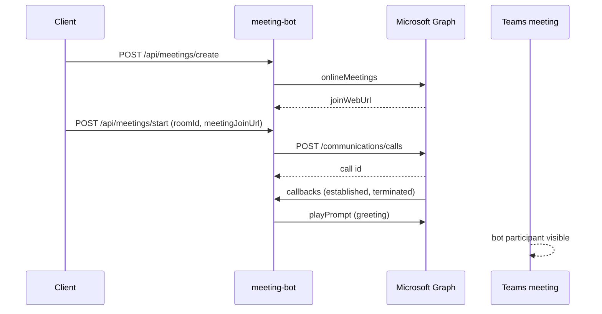

# Teams meeting join — implementation plan

Reference: [Calling and Meeting Bot Sample V4](https://learn.microsoft.com/en-us/samples/officedev/microsoft-teams-samples/officedev-microsoft-teams-samples-bot-calling-meeting-csharp/) (Graph Cloud Communications, not ACS).

## Architecture choice

| Approach | Used by MS sample | This repo |
|----------|-------------------|-----------|
| **Graph `POST /communications/calls`** + callback webhook | Yes | **Phase 1 (default)** — service-hosted media |
| Graph Communications SDK + app-hosted media | Optional (advanced) | Phase 2 — `UseApplicationHostedMedia=true` |
| ACS Call Automation | No | Future alternative (not in MS sample) |

`POST /api/meetings/start` triggers Graph join. Graph notifies the bot at `POST /api/calls/callback` (must be **public HTTPS**, e.g. dev tunnel / ngrok).

## End-to-end flow

## Azure prerequisites (from sample)

1. **App registration** — tenant ID, client ID, client secret.
2. **Application permissions** (admin consent):
   - `Calls.JoinGroupCall.All`
   - `Calls.JoinGroupCallAsGuest.All`
   - `Calls.InitiateGroupCall.All` (if creating calls)
   - `Calls.AccessMedia.All` (play prompt / media)
   - `OnlineMeetings.ReadWrite.All` (create meeting links)
3. **Application access policy** (PowerShell) — grant the app permission to join meetings on behalf of the organizer user ([sample setup](https://learn.microsoft.com/en-us/samples/officedev/microsoft-teams-samples/officedev-microsoft-teams-samples-bot-calling-meeting-csharp/)).
4. **Azure Bot resource** (optional for Bot Framework messaging; **calling webhook** can point to your API host).
5. **Public tunnel** — `MeetingBot__CallbackBaseUrl` = `https://<tunnel>` (not `localhost` for Graph callbacks).

## Configuration

| Setting | Purpose |
|---------|---------|
| `Graph__TenantId`, `ClientId`, `ClientSecret` | App-only token |
| `MeetingBot__CallbackBaseUrl` | Base URL for `.../api/calls/callback` |
| `MeetingBot__OrganizerUserIdOrUpn` | User for `onlineMeetings` create |
| `MeetingBot__UseApplicationHostedMedia` | `false` = HTTP join (start here) |
| `MediaPlatform__*` | Required only when app-hosted media is enabled |

## API contract

- `POST /api/meetings/create` → `{ joinWebUrl, meetingId, ... }`
- `POST /api/meetings/start` → `{ roomId, meetingJoinUrl }` → creates Graph call, returns `callId`
- `POST /api/calls/callback` → Graph notifications (lifecycle, play completion)
- `POST /api/meetings/leave` → ends Graph call

## Local dev checklist

1. `dotnet run` in `backend/meeting-bot` (default `http://localhost:5213`).
2. Start tunnel to the same port: `devtunnel host -p 5213 --allow-anonymous` or `ngrok http 5213`.
3. Set `MeetingBot__CallbackBaseUrl` to the tunnel HTTPS URL.
4. Create meeting → copy `joinWebUrl` → `POST /api/meetings/start`.
5. Open Teams meeting; confirm bot joins after Graph establishes the call.

## Phases after join works

1. **STT loop** — `EnableSttVoiceLoop` + local loopback (dev) or app-hosted RTP (prod).
2. **Interview turns** — existing `/api/rooms/{roomId}/turn` + `playPrompt` with TTS URI.
3. **ACS** — only if you later need ACS-specific telephony; not required for Teams join per MS sample.
